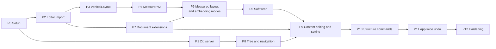

# Pararec Implementation Plan

Companion to [SPEC.md](./SPEC.md). Section references (§) point there.

Phase numbers are identifiers. Follow the dependency graph, which schedules P7 and P6 before P5.

The plan runs on two tracks that meet at Phase 9. Track A builds the Zig server, and Track B turns the kozane editor into the Content editor. They share no code, so they can run in parallel. Each phase ends with a check that can be run by hand against a real JSON file or a test suite.

---

## P0 · Project setup

- [x] Confirm a compiler compatible with the existing server and minimum Zig version 0.16.0. Pin the exact compiler in CI and setup instructions (§10).
- [x] Rename existing `server/` to `local/`, retaining its build files, entry point, and `zig build test` step. Update package scripts, CI, and build/run paths, including the compiled executable path. Add the modules in SPEC §4.5.
- [x] Keep root-level Vitest and package scripts. Add Playwright and configure both tools for `client/`.
- [x] Add CI that runs `zig build test`, vitest, and Playwright on Chromium and WebKit.
- [x] Retain Vite output at root `dist/` and use `--static ./dist`. Update run scripts for the new CLI and the development proxy to port 4545, rewriting Host and Origin to the upstream origin.
- [x] Add sample documents under `fixtures/`: empty, flat, three levels deep, and long multi-line Contents with Japanese text and emoji.

Done when CI runs server and client smoke tests and a browser page load.

Setup is implemented with Zig 0.16.0 pinned in `.zigversion` and CI. Type checks, production builds, Zig tests, client tests, and API-only Playwright checks pass locally. The CI workflow has been added but has not run remotely. Browser page-load checks remain unverified here because the environment cannot reach Playwright's download host.

## P1 · Zig server (Track A)

- [x] `schema.zig`: structs for `Content`, `Container`, and `Schema`, parsed with `std.json`, ignoring unknown fields (§3.1, §3.4).
- [x] `schema.zig`: invariant checks 1 to 5, each with its own error message (§3.2).
- [x] `store.zig`: read the file and compute the ETag (first 16 bytes of SHA-256, quoted hex, from the same bytes returned by GET) (§4.2).
- [x] `store.zig`: write procedure with atomic backup replacement, a synced temporary file, rename, and directory sync where supported, under one mutex. Verify APIs against the pinned compiler (§4.3).
- [x] `store.zig`: pretty-print with two-space indentation and a trailing newline (§3.4).
- [x] `http.zig`: `GET /api/document` and `PUT /api/document` with `If-Match`, including `If-None-Match: *` for creation, quoted ETags for updates, and malformed/conflicting header checks (§4.2).
- [x] `http.zig`: status codes `400`, `403`, `404`, `412`, `413`, `428` (§4.2).
- [x] `http.zig`: `Host` and `Origin` checks; no CORS headers (§4.4).
- [x] `http.zig`: static files from `--static` with an `index.html` fallback.
- [x] `main.zig`: `pararec serve <file> [--port] [--static]`, bound to `127.0.0.1` (§4.1).
- [x] Tests: each invariant violation, ETag mismatch, creation races, backup failure, failures before and after rename, and header checks over a real socket. Test an external write between check and replacement and record the limitation in SPEC §4.3.

Done when curl can read and write a fixture, and invalid JSON, a stale `If-Match`, and a foreign `Origin` are all rejected.

Implemented and verified with `pnpm test:local` and `pnpm test:api`. HTTP integration tests use Node's built-in test runner over real sockets. Coverage includes canonical fixture round trips, concurrent writes, external edits, creation races, backup failures, and failures before and after replacement. The external-writer limitation is also tested.

## P2 · Editor import (Track B)

- [ ] Bring `document-store.svelte.ts`, `geometry.ts`, and `EditorSurface.svelte` from kozane into `client/src/lib/editor/`, or into a shared package (§10).
- [ ] Verify Reed history boundaries, group detection, transactions, and redo behavior. Choose and record the native or snapshot strategy from SPEC §5.4 before structure commands.
- [ ] Bring their existing tests and make them pass unchanged.
- [ ] Add a demo route that edits one fixture Content in isolation.

Done when the imported editor and its tests run in Pararec with no behaviour change.

## P3 · VerticalLayout

- [ ] Define `VerticalLayout` and implement `FixedLayout` (§6.2).
- [ ] Route `visibleRange`, `caretPoint`, `pointToCaret`, and `selectionRects` through the layout instead of `lineHeight` arithmetic.
- [ ] Update the surface to position lines and size its content from the layout.

Done when every existing test passes and the editor looks identical.

## P4 · Measurer v2

- [ ] Define the new `LineMeasurer` interface: `columnToPoint`, `pointToColumn`, `rangeRects`, `visualRows` (§6.3).
- [ ] Implement the arithmetic measurer for tests.
- [ ] Implement the DOM measurer over several spans per line, using `data-from`.
- [ ] Implement `pointToColumn` with `caretPositionFromPoint`, then `caretRangeFromPoint`, then binary search.
- [ ] Move the pre-edit splice to work on spans rather than on a single text node.

Done when clicks and caret positions match the old behaviour, still rendering one span per line.

## P5 · Soft wrap (needs P6)

- [ ] Switch lines to `white-space: pre-wrap` (§6.4).
- [ ] ↑ and ↓ by visual row with goalX; Home and End to the ends of the visual row (§6.5).
- [ ] Selection drawn as one rectangle per visual row.
- [ ] Caret placement at a wrap point (end of one row versus start of the next).

Done when clicking, vertical movement, and selection line up on a long Japanese paragraph in Chromium and WebKit, and resizing rewraps without the text jumping.

## P6 · Measured layout and embedding modes (needs P4, P7, runs before P5)

- [ ] Implement `MeasuredLayout` on a Fenwick tree with `setHeight` and `splice` (§6.2).
- [ ] Height estimates for unmeasured lines; one `ResizeObserver` for rendered lines.
- [ ] Scroll anchoring when a line above the viewport changes height.
- [ ] Auto-height mode: no internal scrolling, height from `layout.totalHeight`, all lines rendered (§6.4).
- [ ] Read-only mode sharing the line component, with no input or caret layer (§6.4).

Done when focusing a Content causes no layout shift and height updates preserve the scroll anchor. Verify rewrapping on resize in P5.

## P7 · Document extensions (Track B, parallel to P3–P4)

- [ ] Switch to `createDocumentStoreWithEvents` and expose `lastChange`, including for undo and redo (§6.1). Resolve the event-payload question first (§10).
- [ ] `transact(fn)` producing one app undo action under the strategy chosen in P2. Confirm Reed's transaction API (§10).
- [ ] Grapheme stepping and snapping with `Intl.Segmenter`, cached per line text.
- [ ] Line-break normalization on paste.
- [ ] Implement group boundaries on blur, structural commands, undo, redo, and composition commits under the chosen strategy (§5.4).

Done when emoji sequences and variation selectors move and delete as one unit, and a `transact` call undoes in one step.

## P8 · Tree and navigation (needs P1)

- [ ] `TreeStore` with the immutable tree and the incremental id index (§5.1).
- [ ] `ops.ts` with every op in the table and its inverse (§5.1).
- [ ] Client-side invariant checks matching the server's.
- [ ] `api/` client: `GET` with ETag, empty document on `404`.
- [ ] `Pad`, `ContainerRow`, `LeftCell`, `RightCell`, and `Breadcrumb` in read-only form (§5.2).
- [ ] Nested children one level deep, count badges, and the parent heading clipped to three lines.
- [ ] `path` navigation with Ctrl+. and Ctrl+,, the URL hash, and focus restoration on return.
- [ ] Empty-level Add row control activated by Enter or mouse, including after deleting the last row.
- [ ] Validate URL paths as ancestor chains and truncate at the first invalid segment.
- [ ] 35:65 column widths at both depths.
- [ ] Tests: every op and inverse pair; invariants after random op sequences.

Done when the three-level fixture opens and every level can be reached and left again with the keyboard and the mouse.

## P9 · Content editing and saving (needs P5, P7, P8)

- [ ] `ContentEditor.svelte` implementing the embedding contract (§6.6).
- [ ] `ContentView.svelte` switching between read-only mode and the editor on focus.
- [ ] Content stores: create on focus, synchronize each edit into the tree, cache 50 unpinned stores, and invalidate stores on tree text restoration (§5.1).
- [ ] `onBoundary` handling in `Pad`: ↑, ↓, ←, → across Contents, cells, and Containers with goalX (§5.3).
- [ ] Alt+← and Alt+→ between columns.
- [ ] Autosave: debounce, blur, page-hidden attempt, revision-aware acknowledgement, and serialized follow-up saves (§5.1). Add dirty/saving/saved/failed states and Retry.
- [ ] The `412` dialog with Reload and Overwrite. Suspend autosave during conflicts. Reload waits for in-flight requests and resets stores, history, and stale focus state.
- [ ] IndexedDB recovery snapshots, Restore/Discard controls, dirty `beforeunload` warning, and recovery-storage failure handling.
- [ ] Tests for interrupted saves, recovery, stale caches after undo, and Reload followed by another save.
- [ ] Line-break normalization on load.

Done when text typed with a Japanese IME is saved to the file, survives a reload, and an external edit to the file triggers the `412` dialog.

## P10 · Structure commands

- [ ] Alt+Enter on a left Content: split (§5.3).
- [ ] Alt+Enter on a right Content: new sibling Container with the text after the caret.
- [ ] Ctrl+Enter on a right Content: new child Container, entering its level when it is a grandchild.
- [ ] Backspace at the start of a left Content: join with the previous one.
- [ ] Backspace on an empty right Content: delete the Container when allowed.
- [ ] Alt+↑ and Alt+↓ for Containers and for left Contents, including moves into neighbouring Containers. Reject moves of the source cell's last Content across Containers.
- [ ] Focus and caret placement after every command.

Done when a document can be built and rearranged from the keyboard alone, with the server accepting every save.

## P11 · App-wide undo

- [ ] History under the P2 strategy with a 500-entry cap. Native history uses `text`, `tree`, and `composite` entries. The fallback uses snapshots for all actions (§5.4).
- [ ] For native history, push `text` entries on new Reed groups. Clear app redo on every new edit, including edits merged into an existing group.
- [ ] Make split, join, and Alt+Enter on a right Content one undo action through composites or snapshots, according to the chosen strategy.
- [ ] Navigate to the recorded `path` before undoing or redoing.
- [ ] Pin Content stores that the history references, so the LRU never evicts them.
- [ ] For snapshot history, restore tree, path, focus, and caret and dispose cached stores. Disable native Reed undo. Never retain text entries after rebuilding their stores.
- [ ] Tests: mixed actions, edit/move/edit within 300 ms, grouped edits after undo, empty-level creation, and undo followed by save and reload.

Done when 20 mixed actions can be undone back to the original file contents and redone to the final state.

## P12 · Hardening

- [ ] Playwright suite for the scenarios in §7 on Chromium and WebKit.
- [ ] IME checks on macOS and Windows: Japanese input, Enter during composition, pre-edit across a wrap point.
- [ ] Measure browser input-to-render latency against §7 with a 5,000-line Content. Record hardware, browser, scope, and percentiles. Use Vitest for document/layout microbenchmarks only.
- [ ] A level with 1,000 Containers: measure rendering time and decide whether row virtualization is needed in Stage 2.
- [ ] Error states: server not running, file unreadable, invalid file on disk.
- [ ] README: how to build, run `pararec serve`, and develop the client against it.

Done when the suite is green in CI and the measured numbers are recorded in this file.

---

## Later stages (not scheduled)

- [ ] Confirmed delete for Containers with children.
- [ ] Row virtualization for long levels.
- [ ] Markdown live preview through the decoration layer (SPEC §8).
- [ ] Watching the file for external changes.
- [ ] Multiple documents and a file list in the Zig server.