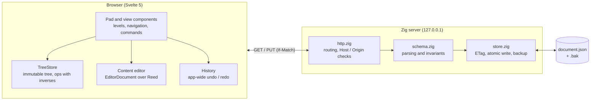

# Pararec Specification

Status: draft · Stage 1

Pararec is a two-column, legal-pad style editor. Each row pairs one or more left-hand notes with a right-hand note, and every right-hand note can hold a nested two-column structure of its own. The client is written in Svelte 5 and edits text through [Reed](https://github.com/kozmof/reed). A small local server written in Zig reads and writes a single JSON file.

---

## 1. Overview

### 1.1 Goals

- Edit a recursive two-column document entirely from the keyboard, including Japanese input through an IME.
- Keep each note (`Content`) a multi-line text document, edited by a Reed-backed editor with soft wrapping.
- Show at most two levels at once (the current level and its children) and let the user move up and down the hierarchy.
- Persist to one local JSON file without publishing a partial replacement, and detect external changes present when a save is checked.

### 1.2 Non-goals (Stage 1)

- Multiple files, a file browser, or search.
- Sync, collaboration, or watching the file for external changes.
- Markdown rendering (planned; see §8).
- Virtualizing very long levels.
- Many-to-many links between left and right notes.

### 1.3 Glossary

| Term | Meaning |
| --- | --- |
| Content | One note: an id and a multi-line text. |
| Container | One row: one or more left Contents, one right Content, and the right Content's children. |
| Level | The list of Containers shown at the top of the view: `Schema.root` or some Container's `right.children`. |
| Path | The ids of the Containers entered from the root to reach the current level. |
| Cell | The left or right side of a Container as drawn on screen. A left cell stacks several Contents. |
| Content editor | The Reed-based text editor mounted on the focused Content (§6). |

---

## 2. Architecture

The browser holds all editing state. The Zig server only exchanges whole documents with the client and guards the file on disk.



Reed is used only inside the Content editor. Structure, persistence, and app-wide undo live outside Reed.

### 2.1 Repository layout

```
pararec/
  client/                      Svelte 5 application
    src/schema.ts              data types (existing)
    src/lib/tree/              TreeStore, ops, index
    src/lib/history/           app-wide history
    src/lib/api/               local server client
    src/lib/editor/            Content editor (§6)
    src/components/            Pad, Breadcrumb, ContainerRow, cells
  local/                       Zig server
    build.zig, build.zig.zon
    src/main.zig, http.zig, schema.zig, store.zig
```

The server lives in `local/`, renamed from the initial `server/` directory. Root package scripts build `local/zig-out/bin/pararec` and the client at `dist/`. The development proxy forwards to port 4545 and rewrites Host and Origin for requests from the development page, preserving production header checks.

Whether `src/lib/editor/` is copied from kozane or extracted into a shared package is an open question (§10).

---

## 3. Data model

### 3.1 Types

The existing `client/src/schema.ts` is the file format. The JSON on disk has exactly this shape.

```ts
type Content = { id: string; text: string };

type Container = {
  id: string;
  left: Content[];
  right: Content & { children: Container[] };
};

type Schema = { version: number; root: Container[] };
```

### 3.2 Invariants

Both the client and the server check these. The server rejects a violating document with `400` and does not write it.

1. `version` is `1`.
2. Every id (`Container.id`, each `left[].id`, `right.id`) is unique across the whole file. Container moves into themselves or their descendants are rejected.
3. `Content.text` may contain line breaks. Line breaks are `\n` only; `\r` never appears. The client normalizes `\r\n` and `\r` to `\n` on load and on paste.
4. `left` has at least one element. An empty left cell is one Content with empty text.
5. `right.id` differs from its `Container.id`, so the right Content can be referenced on its own.

### 3.3 Ids

The client creates ids with `crypto.randomUUID()`. The server never creates ids; it only checks uniqueness. A Content keeps its id while its text is edited. When a Content is split, the first half keeps the id and the second half gets a new one. When two Contents are joined, the earlier one's id survives.

### 3.4 File format

- UTF-8 without a BOM.
- Pretty-printed with two-space indentation and a trailing newline, so diffs stay readable in Git.
- Unknown fields are ignored on read, for forward compatibility.

---

## 4. Local server (Zig)

### 4.1 Command line

```
pararec serve <document.json> [--port 4545] [--static ./dist]
```

The server binds to `127.0.0.1` only. It serves the client build from `--static` so that the page and the API share one origin.

### 4.2 API

| Request | Success | Errors |
| --- | --- | --- |
| `GET /api/document` | `200`, JSON body, `ETag` header | `404` if the file does not exist; the client then starts an empty document |
| `PUT /api/document` | `200`, new `ETag` | `428` without a supported precondition, `412` on mismatch, `400` on invalid JSON or a broken invariant, `413` above 16 MB, `403` on a bad `Host` or `Origin` |
| `GET /*` | static file from `--static` | extensionless paths fall back to `index.html`. Missing assets return `404` |

The `ETag` is a strong, quoted entity tag containing the first 16 bytes of SHA-256 in hex, such as `"0123456789abcdef0123456789abcdef"`. GET hashes the same bytes it returns. PUT returns the ETag of the bytes actually written. Modification times are not used because their precision varies between file systems.

To create the file, send `If-None-Match: *`, which succeeds only when it does not exist. Updates send one strong quoted ETag in `If-Match`. ETag lists and weak validators are not supported. `If-Match: *` requires an existing file. Reject malformed or conflicting preconditions with `400`. A failed precondition returns `412`, including when the file was deleted before an update.

### 4.3 Write procedure

1. Parse the body with `std.json` into the schema structs and check the invariants.
2. Read the current file once and evaluate the precondition against those bytes or its absence. On failure, return `412`.
3. If the file exists, atomically replace `<document.json>.bak` with those bytes, keeping one generation. Abort if the backup fails. Skip backup on first creation.
4. Write the formatted document to a temporary file in the same directory, sync it, and rename over the original. Sync the parent directory where supported. Verify the atomic-write API against the pinned Zig version. Return success after these steps complete. A failure before replacement leaves the original intact. A failure after replacement is an uncertain save outcome, so the client re-reads the file and ETag before retrying.

A single mutex serializes steps 1 to 4, so two concurrent `PUT`s cannot interleave their check and write. Atomic replacement prevents a partial document from becoming visible.

Other processes do not share this mutex. An external write between the check and replacement can be overwritten. Stage 1 detects changes present at the check. Coordination with external writers throughout the save is outside this stage.

### 4.4 Security

- Bind to `127.0.0.1` only.
- Reject any request whose `Host` is not `127.0.0.1:<port>` or `localhost:<port>` with `403`, to block DNS rebinding.
- Accept `PUT` only when `Origin` matches the server's own origin. Do not send CORS headers.

### 4.5 Modules

| File | Responsibility |
| --- | --- |
| `build.zig`, `build.zig.zon` | Build definition and minimum Zig version. CI pins the exact compiler |
| `src/main.zig` | Argument parsing and server start-up |
| `src/http.zig` | Routing, header checks, static files |
| `src/schema.zig` | Struct definitions and invariant checks |
| `src/store.zig` | Reading, hashing, backup, atomic writes |

---

## 5. Client application

### 5.1 State

#### TreeStore

- Holds the `Schema` as an immutable, structurally shared tree in `$state.raw`.
- Maintains an index `id → { container, parentId, index, side }`, rebuilt incrementally after each change.
- Changes the tree only through pure functions in `ops.ts`. Each op returns the inverse op that undoes it.

| Op | Effect |
| --- | --- |
| `insertContainer(parentId, index, container)` | Adds a Container to a level |
| `removeContainer(id)` | Removes a Container that has no children |
| `moveContainer(id, parentId, index)` | Moves a Container within or between levels |
| `insertContent(containerId, index, content)` | Adds a left Content |
| `removeContent(id)` | Removes a left Content (never the last one) |
| `moveContent(id, containerId, index)` | Moves a left Content. Reject a cross-Container move of the source cell's last Content |
| `setText(id, text)` | Replaces a Content's text |

#### Content stores

- Create at most one Reed store per Content, on focus. Commit each text change to the tree with `setText`, without a separate tree history entry. The tree is authoritative for serialization and unfocused rendering.
- Publish each edit and its tree update together. Blur ends the current undo group and unmounts the editor.
- Cache up to 50 unpinned stores. Undo and redo references pin stores, so the total may exceed 50. Dispose unpinned stores when evicted.
- Tree or snapshot text restoration invalidates affected stores and rebuilds the focused editor from the restored tree. Native Reed undo and redo commit their resulting text to the tree before saving.
- Retain removed Contents' stores only while history references them. Saving serializes existing tree nodes only.

#### Saving

- Save one second after the last change and on blur. Show dirty, saving, saved, conflict, and failed states. Failed requests keep the document dirty and offer Retry.
- Serialize a tree snapshot and revision. Send its ETag in `If-Match`, or `If-None-Match: *` after a missing-file load. Allow only one in-flight save. A successful response acknowledges that revision, not later edits. Later changes trigger a follow-up save with the returned ETag.
- On `412`, suspend autosave and offer Reload or Overwrite. Reload cancels queued saves, waits for the in-flight request to settle, then replaces tree and ETag and clears stores, history, redo, and stale focus references. Overwrite fetches the current ETag and retries the local snapshot, using the creation precondition if the file is missing. Another conflict requires another user choice.
- Persist dirty tree snapshots to IndexedDB, keyed by origin and document endpoint. On startup, offer Restore or Discard for a recovery snapshot. Restore uses the freshly loaded ETag and requires confirmation before replacing a different disk document. Remove a recovery record only after the latest revision is acknowledged by the server. Surface recovery-storage failures.
- Attempt a save when the page becomes hidden. While dirty, use `beforeunload` to warn about leaving. It does not guarantee save completion. Browser termination can interrupt network and local persistence. Recovery restores the latest completed local snapshot.

### 5.2 View and navigation

The view is fully determined by `path: string[]`. An empty path shows `Schema.root`; otherwise the view shows the last Container's `right.children`.

#### Empty levels

When a level has no Containers, show an Add row control. Enter or activating the control creates a Container with fresh ids, one empty left Content, one empty right Content, and no children, then focuses its right Content. This applies to a missing file, empty root or child level, and deletion of the last row. Creation is one undoable action.

#### What is drawn

- The current level's Containers are drawn top to bottom as rows. A row is as tall as the taller of its left cell (all left Contents) and its right cell (the right Content plus nested children).
- Left Contents are stacked with a thin divider between them.
- Content text soft-wraps to the column width and is never truncated.
- If a right Content has children, they are drawn one level deep, as a nested two-column grid below the right Content.
- Grandchildren are not drawn. A badge shows their count; activating it enters that child's level.
- Inside a level, the parent's right Content is shown above the rows as a heading, clipped to three lines.

#### Moving between levels

- `Ctrl+.` on a right Content with children, or activating a count badge, pushes that Container onto `path`.
- `Ctrl+,` or a breadcrumb item moves up.
- The view remembers which Content was focused at each level and restores focus on return.
- `path` is mirrored in the URL hash as `#/c/<id>/<id>…`, so the browser's back button and reloads keep the level. Validate ids as an ancestor chain from the root. Truncate at the first invalid segment and open the deepest valid prefix. Entering a visible nested Container appends its containing ancestor and its own id when needed.

#### Column widths

Left and right columns split 35:65. Nested grids use the same ratio, so the innermost right column is about 42% of the full width. The nested left column is about 23% of the full width. Both figures exclude padding and dividers.

#### Components

| Component | Responsibility |
| --- | --- |
| `Pad.svelte` | Root. Owns the TreeStore, path, focus, history, and save loop |
| `Breadcrumb.svelte` | Shows the first line of each ancestor's right Content; clicking moves up |
| `ContainerRow.svelte` | One row; takes `depth` (0 or 1) and draws a count badge instead of children at depth 1 |
| `LeftCell.svelte` | Stacks the left Contents of one Container |
| `RightCell.svelte` | Draws the right Content and, at depth 0, the nested children |
| `ContentView.svelte` | Draws one Content: read-only when unfocused, the Content editor when focused (§6.6) |

### 5.3 Commands and key bindings

Text editing inside a Content belongs to the Content editor. Anything that crosses a Content boundary or changes structure belongs to `Pad`. Keys reach the editor's `onKeydown` hook first; the bindings below are forwarded to `Pad`. On macOS, Ctrl reads as Cmd.

| Key | Where | Action |
| --- | --- | --- |
| Enter | any Content | Insert a line break |
| Alt+Enter | left Content | Split the Content at the caret; the second half becomes a new left Content |
| Alt+Enter | right Content | Create the next sibling Container and move the text after the caret into its right Content |
| Ctrl+Enter | right Content | Append a child Container and focus its right Content; enter its level if it would be a grandchild |
| ↑ / ↓ | any Content | On the first or last visual line, move to the previous or next Content in the same column, then to the Container above or below; keep goalX |
| ← / → | any Content | At the start or end, move to the previous or next Content in the same column |
| Alt+← / Alt+→ | any Content | Move to the other column of the same Container |
| Alt+↑ / Alt+↓ | right Content | Move the Container up or down among its siblings |
| Alt+↑ / Alt+↓ | left Content | Move the Content up or down; at the edge of the cell, move it into the neighbouring Container's left cell only if another Content remains in the source. Otherwise do nothing |
| Backspace | start of a left Content | Join it to the previous Content in the same cell with a line break between; does nothing on the cell's first Content |
| Backspace | empty right Content | Delete the Container if all its left Contents are empty and it has no children |
| Ctrl+. / Ctrl+, | anywhere | Enter the child level / return to the parent level |
| Ctrl+Z / Ctrl+Shift+Z | anywhere | App-wide undo / redo |

No key reaches `Pad` while an IME composition is in progress. A Container with children is never deleted by a key; a confirmed delete command is planned for Stage 2.

### 5.4 App-wide undo

Choose the history strategy in P2 after checking Reed's API. There is one history for the whole app. With native history, Reed undoes text edits and inverse ops undo structural changes. The snapshot strategy restores app snapshots instead.

```ts
type HistoryEntry =
  | { kind: "text"; contentId: string; path: string[] }
  | { kind: "tree"; forward: TreeOp; inverse: TreeOp; path: string[] }
  | { kind: "composite"; entries: HistoryEntry[] }
  | { kind: "snapshot"; before: AppSnapshot; after: AppSnapshot };

type AppSnapshot = { schema: Schema; path: string[]; focus: FocusSnapshot | null };
type FocusSnapshot = { contentId: string; line: number; column: number };
```

For native history, use these entry rules.

- `text` is pushed when a Content's Reed store opens a new history entry. Undo dispatches `undo` to that store.
- `tree` is pushed for each structural op. Moving a Content needs only this entry.
- `composite` groups entries that must be undone together, in reverse order: splitting and joining Contents (a Reed edit plus a tree op), and Alt+Enter on a right Content.
- `path` records the level that was shown. Undo and redo first navigate there.
- A new action clears the redo side. The history keeps the last 500 entries.

For native history, programmatic edits inside a composite must start and end their own Reed history entry. End text groups on blur, structural commands, undo, and redo. Clear app redo on every new edit, including edits merged into an existing Reed group.

If Reed cannot isolate edits or report groups reliably, use snapshot entries for all actions from the start. Group compatible typing in one Content within 300 ms. Composition commits and structural commands each form their own entry. Snapshots use structural sharing and restore tree, path, focus, and caret. Restoration disposes cached stores. Disable native Reed undo for this strategy. Do not switch strategies midway through a session or keep text entries after rebuilding their stores.

---

## 6. Content editor

The Content editor is the kozane editor (`EditorDocument`, `EditorSurface`, `geometry.ts`) extended for soft wrapping, variable line heights, and embedding. Its own coordinates are `(line, column)`, where a column counts UTF-16 code units; Reed's byte offsets never leave `EditorDocument`.

### 6.1 Document layer: `EditorDocument`

The existing class is kept as it is: a `$state.raw` snapshot refreshed from Reed's subscription, `(line, column)` carets converted to byte offsets in one place, `insert` / `delete` / `replace` recording the caret on each action so undo restores it, and a 300 ms undo grouping window. It gains four things.

| Member | Kind | Purpose |
| --- | --- | --- |
| `lastChange` | new, `$state.raw` | `{ fromLine, oldEndLine, newEndLine, revision }` of the latest change, including undo and redo |
| `transact(fn)` | new | Runs several edits as one app undo action under the selected strategy |
| `columnBefore` / `columnAfter` | changed | Step by grapheme cluster instead of by code point |
| `clamp` / `snapColumn` | changed | Snap to grapheme boundaries, backwards |

- The store is created with `createDocumentStoreWithEvents`, and `lastChange` is derived from `content-change` events.
- Grapheme boundaries come from `Intl.Segmenter` with `granularity: "grapheme"`, cached per line text. Combining marks, ZWJ emoji, and ideographic variation selectors then move and delete as one unit.

### 6.2 Layout layer: `VerticalLayout`

Every `line * lineHeight` and `y / lineHeight` in `geometry.ts` goes through this interface.

```ts
interface VerticalLayout {
  readonly totalHeight: number;
  top(line: number): number;
  height(line: number): number;
  lineAt(y: number): number;
}

class FixedLayout implements VerticalLayout {}      // current behaviour; used by tests

class MeasuredLayout implements VerticalLayout {
  setHeight(line: number, px: number): void;
  splice(line: number, removed: number, inserted: number): void;
}
```

- `MeasuredLayout` stores heights in a Fenwick tree, so `top` and `lineAt` are O(log n). It splices on `lastChange`.
- Unmeasured lines get an estimate: characters × average character width ÷ column width, rounded up, times the base line height.
- Rendered lines are observed by one `ResizeObserver`, which replaces estimates with measured heights.
- When a line above the visible area changes height, `scrollTop` is corrected by the difference, so the text under the reader does not jump.

### 6.3 Measurement layer: `LineMeasurer`

The measurer keeps the `(line, column)` coordinate system but returns points and rectangles, so it works with wrapped lines and with several text nodes per line.

```ts
type Rect = { top: number; left: number; width: number | null; height: number };

interface LineMeasurer {
  /** Relative to the line's text origin (padding excluded). y is the offset inside the line. */
  columnToPoint(line: number, column: number): { x: number; y: number };
  pointToColumn(line: number, x: number, y: number): number;
  /** Selection rectangles, one per visual row. `to: null` runs to the end of the row. */
  rangeRects(line: number, from: number, to: number | null): Rect[];
  /** The visual rows a wrapped line occupies. */
  visualRows(line: number): { top: number; height: number }[];
}
```

- DOM measurer. Each text span carries `data-from`, its starting column. A column maps to a text node and offset by binary search over spans. `columnToPoint` reads `getClientRects()[0]` of a collapsed `Range`. `pointToColumn` uses `caretPositionFromPoint`, falling back to `caretRangeFromPoint` and then to binary search across spans. `rangeRects` merges a `Range`'s client rects into one rectangle per visual row.
- Arithmetic measurer. Every character is `w` wide and lines wrap at `W`. jsdom has no layout, so all geometry tests use this measurer.

### 6.4 Rendering

- Lines are rendered with `white-space: pre-wrap` and positioned absolutely at `layout.top(line)`.
- The caret and selection rectangles live in a separate layer, drawn from `LineMeasurer` geometry rather than the DOM `Selection`.
- IME pre-edit text is spliced into the span that holds the caret, as an underlined `<span data-preedit>`. Measurement during composition includes the pre-edit, so the candidate window follows the composing text.
- Read-only mode. An unfocused Content is drawn by the same line component with the input and caret layers removed. Font, padding, and wrapping are therefore identical, and focusing a Content never shifts its layout.
- Auto-height mode. Inside Pararec the editor has no scroll container of its own. Its height is `layout.totalHeight`, and all of its lines are rendered. Virtualizing against the page's scroll container is future work.

### 6.5 Input

- A 1 px hidden textarea receives keys, IME composition, and clipboard events, as in kozane today. A composition is inserted once on `compositionend` as an isolated undo action. Save and blur must not commit pre-edit text.
- ↑ and ↓ move by visual row. The caret's x position (goalX) is kept across consecutive vertical moves and resolved on the target row with `pointToColumn`.
- Home and End move to the ends of the visual row.
- Copy and cut write the plain text. Paste reads `text/plain` only and normalizes line breaks.

### 6.6 Embedding contract

`ContentEditor.svelte` is how `Pad` mounts the editor on a focused Content.

```ts
type Entry =
  | { kind: "caret"; line: number; column: number }
  | { kind: "edge"; edge: "start" | "end"; goalX?: number };

type Boundary = "up" | "down" | "left" | "right";

interface ContentEditorProps {
  doc: EditorDocument;
  entry: Entry;                                   // where to put the caret on mount
  onBoundary(direction: Boundary, goalX: number): void;
  onCommand(command: "split" | "newSibling" | "newChild" | "join" | "deleteContainer"
                   | "moveUp" | "moveDown" | "otherColumn" | "enter" | "leave"): void;
  onKeydown?(event: KeyboardEvent): boolean;      // return true when handled (Vim mode etc.)
  onHeight?(px: number): void;
}
```

- `onBoundary` fires when ↑, ↓, ←, or → would leave the Content. `Pad` decides where focus goes and mounts the next editor with an `edge` entry carrying goalX.
- `onCommand` fires for the bindings in §5.3 that change structure. `Pad` performs them and records history.
- The editor never changes the tree itself.

---

## 7. Testing

| Target | Tooling | What is checked |
| --- | --- | --- |
| `ops.ts` | vitest | Each op and inverse restores the tree. Invariants hold after every op, including rejected moves of the last left Content |
| Content split, join, and move | vitest | Ids and text are restored after undo |
| History | vitest | Mixed actions, group boundaries, snapshot fallback, navigation, and restored text surviving a save |
| `EditorDocument` | vitest | Grapheme stepping and deletion; `transact` undoes in one step; `lastChange` after undo |
| `MeasuredLayout` | vitest | `top` and `lineAt` agree; splicing; estimates replaced by measurements |
| Geometry | vitest + arithmetic measurer | Visual-row movement and goalX, selection rectangles, wrapping |
| `schema.zig` | `zig build test` | Each invariant violation yields `400`; unknown fields are ignored |
| `store.zig` | `zig build test` | Creation and update preconditions, backup failures, failures before and after rename, and external changes during replacement |
| HTTP | `zig build test` and Node's test runner with real sockets | `Host` and `Origin` checks, `413`, static files |
| Application | Playwright (Chromium, WebKit) | Empty-level creation, cross-Content navigation, composition events, URL validation, conflicts, Reload reset, and recovery |
| Performance | vitest bench | Document and layout microbenchmarks. Browser input-to-render latency in a 5,000-line Content targets under 8 ms, measured separately with hardware, browser, scope, and percentiles recorded |

---

## 8. Future: Markdown live preview

A later stage can render Markdown inside each Content without changing the data model. The plan is a pure decoration layer, `decorateLine(text, startState) → LineDecoration`, cached per line and invalidated from `lastChange`. Block state (fenced code, quotes, lists) carries from line to line. Markers are hidden outside the block that holds the caret and shown inside it, keeping line heights constant. The measurer in §6.3 already supports the several spans per line and hidden segments that this needs.

---

## 9. Constants

| Name | Value |
| --- | --- |
| Undo grouping window | 300 ms |
| Autosave delay | 1 s |
| Unpinned Reed stores (LRU) | 50, plus history-pinned stores |
| History length | 500 entries |
| Maximum request body | 16 MB |
| Default port | 4545 |
| Column ratio (left : right) | 35 : 65 |

---

## 10. Open questions

- [x] Pin Zig 0.16.0 in `.zigversion` and CI. HTTP and JSON APIs are verified by builds and tests. Atomic writes use `std.Io.Dir.createFileAtomic` and `std.Io.File.Atomic`, followed by directory sync on supported platforms.
- [ ] Does Reed's `content-change` event carry the changed byte range? If not, derive `lastChange` from the edit for normal edits and by comparing line contents of the snapshots for undo and redo.
- [ ] In P2, verify forced history boundaries, group detection, and redo behavior. Choose the native or snapshot strategy in §5.4 before implementing structure commands.
- [ ] What is the name and shape of Reed's transaction API, and how does it interact with the 300 ms grouping window?
- [ ] Copy the kozane editor into `client/src/lib/editor/` or extract it into a shared package.
- [ ] Confirmation UI for deleting a Container that has children (Stage 2).
- [ ] Whether the Zig side later becomes a desktop WebView host. The HTTP API would still apply.
